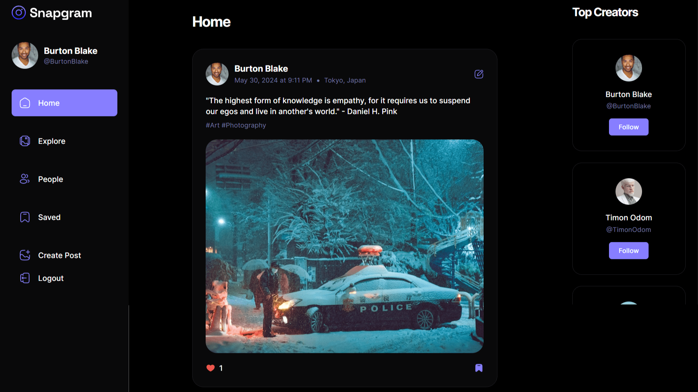

<div align="center">
    <a href="https://snapgram-fv.vercel.app" target="_blank">
      
    </a>
  <h3 align="center">Instagram Clone</h3>
</div>

##  <br /> 📋 <a name="table">Table of Contents</a>

- ✨ [Introduction](#introduction)
- ⚙️ [Tech Stack](#tech-stack)
- 📝 [Features](#features)
- 🚀 [Quick Start](#quick-start)

##  <br /> <a name="introduction">✨ Introduction</a>

**[EN]** Explore social media with this user-friendly platform that has a nice look and lots of features. Easily create and explore posts, and enjoy a strong authentication system and quick data fetching using React Query for a smooth user experience.

**[FR]** Explorez les réseaux sociaux avec cette plateforme conviviale, au design élégant et riche en fonctionnalités. Créez et découvrez des publications facilement, et bénéficiez d'un système d'authentification sécurisé ainsi que d'une récupération rapide des données grâce à React Query, pour une expérience utilisateur fluide et agréable.

##  <br /> <a name="tech-stack">⚙️ Tech Stack</a>

- [**React**](https://react.dev/reference/react) is a popular JavaScript library for building user interfaces, particularly single-page applications where data changes over time. React's component-based architecture allows developers to create reusable UI components, making development more efficient and the codebase easier to maintain. Its virtual DOM enhances performance by minimizing direct interactions with the browser's DOM.

- [**Appwrite**](https://appwrite.io/docs) is an open-source backend platform that offers a wide range of backend services including authentication, database management, file storage, and cloud functions. It is designed to simplify backend development for web and mobile applications, providing a unified API and robust security features. Appwrite supports scalability and real-time updates, making it suitable for a variety of application use cases.

- [**React Query**](https://tanstack.com/query/latest/docs/framework/react/overview) is a powerful data-fetching library for React applications that simplifies data synchronization and caching. It enhances user experience by managing server state, providing features like automated caching, background updates, and stale data handling. React Query's built-in hooks and dev tools offer an intuitive API and debugging capabilities, making data management efficient and seamless.

- [**TypeScript**](https://www.typescriptlang.org/docs/) is a statically typed superset of JavaScript that allows for early detection of errors and more robust, maintainable code. TypeScript's type system helps developers catch mistakes early during the development process, ensuring a more stable and reliable application.

- [**Tailwind**](https://v2.tailwindcss.com/docs) is a utility-first CSS framework that speeds up UI development by providing a set of pre-built utility classes. It allows developers to quickly build custom designs without writing traditional CSS, promoting rapid prototyping and design consistency.

- [**shadcn/ui**](https://ui.shadcn.com/docs) is as comprehensive React component library designed for creating modern and responsive user interfaces. ShadCN offers a wide range of pre-built, customizable components that adhere to best practices for accessibility and performance. Its intuitive API and well-documented components enable developers to build consistent and aesthetically pleasing UIs with ease.


## <br/> <a name="features">📝 Features</a>

👉 **Authentication System**: A robust authentication system ensuring security and user privacy.

👉 **Explore Page**: Homepage for users to explore posts, with a featured section for top creators.

👉 **Like and Save Functionality**: Enable users to like and save posts, with dedicated pages for managing liked and saved content.

👉 **Detailed Post Page**: A detailed post page displaying content and related posts for an immersive user experience.

👉 **Profile Page**: A user profile page showcasing liked posts and providing options to edit the profile.

👉 **Browse Other Users**: Allow users to browse and explore other users' profiles and posts.

👉 **Create Post Page**: Implement a user-friendly create post page with effortless file management, storage, and drag-drop feature.

👉 **Edit Post Functionality**: Provide users with the ability to edit the content of their posts at any time.

👉 **Responsive UI with Bottom Bar**: A responsive UI with a bottom bar, enhancing the mobile app feel for seamless navigation.

👉 **React Query Integration**: Incorporate the React Query (Tanstack Query) data fetching library for, Auto caching to enhance performance, Parallel queries for efficient data retrieval, First-class Mutations, etc.

👉 **Backend as a Service (BaaS) - Appwrite**: Utilize Appwrite as a Backend as a Service solution for streamlined backend development, offering features like authentication, database, file storage, and more.

## <br /> <a name="quick-start">🚀 Quick Start</a>

Follow these steps to set up the project locally on your machine.

<br/>**Prerequisites**

Make sure you have the following installed on your machine:

- [Git](https://git-scm.com/)
- [Node.js](https://nodejs.org/en)
- [npm](https://www.npmjs.com/) (Node Package Manager)

<br/>**Cloning the Repository**

```bash
git clone {git remote URL}
```

<br/>**Installation**

Let's install the project dependencies, from your terminal, run:

```bash
npm install
# or
yarn install
```

<br/>**Set Up Environment Variables**

Create a new file named `.env` in the root of your project and add the following content:

```env
# Appwrite
VITE_APPWRITE_URL='https://cloud.appwrite.io/v1'
VITE_APPWRITE_PROJECT_ID=
VITE_APPWRITE_DATABASE_ID=
VITE_APPWRITE_STORAGE_ID=
VITE_APPWRITE_USER_COLLECTION_ID=
VITE_APPWRITE_POST_COLLECTION_ID=
VITE_APPWRITE_SAVES_COLLECTION_ID=
```

Replace the placeholder values with your actual respective account credentials:

- [Appwrite](https://cloud.appwrite.io/)


<br/>**Running the Project**

Installation will take a minute or two, but once that's done, you should be able to run the following command:

```bash
npm run dev
# or
yarn dev
```

Open [`http://localhost:5173`](http://localhost:5173) in your browser to view the project.